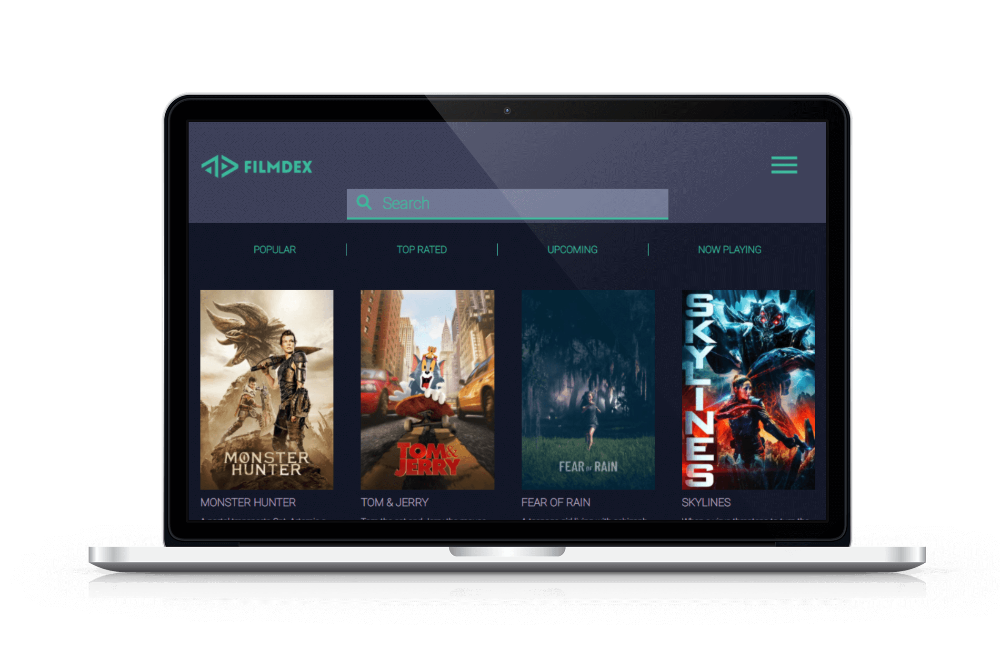

# Filmdex - React Movie App



Filmdex is a movie database web application that allows users to view, sort, and search for movies in a database, which was built as a project during BCIT's Technical Web Designer program. It has a search bar, that shows live search results, as well as a Favorites List that allows users to add their favorite films without logging in.

The web application was created using ReactJS by first installing NPM, node,js, and create-react-app, and then pulling data from the The Movie Database (TMDb) API. My role was focused on responsive design and on Sass styling. Specifically, my focus was to create the individual components, being the homepage grid, the single movie layout, as well as the footer.

* [Link to deployed version](https://mbui.bcitwebdeveloper.ca/twd-movie-app/)
* [Read more on my portfolio site](https://www.minabui.com/movieapp)

## How to Load the App

```
git clone https://github.com/mina-bui/twd-movie-app-final-version.git
npm install
npm start
```

### Built with

* [Javascript](https://www.javascript.com/)
* [React.js create-react-app](https://create-react-app.dev/)
* [Sass](https://sass-lang.com/)
* [npm](https://www.npmjs.com/)
* [Node.js](https://nodejs.org/en/)

## Acknowledgments

* A special thanks to Michael Whyte, the TWD program head, for helping us through building this app, even coming to help after school hours. We are so grateful!
